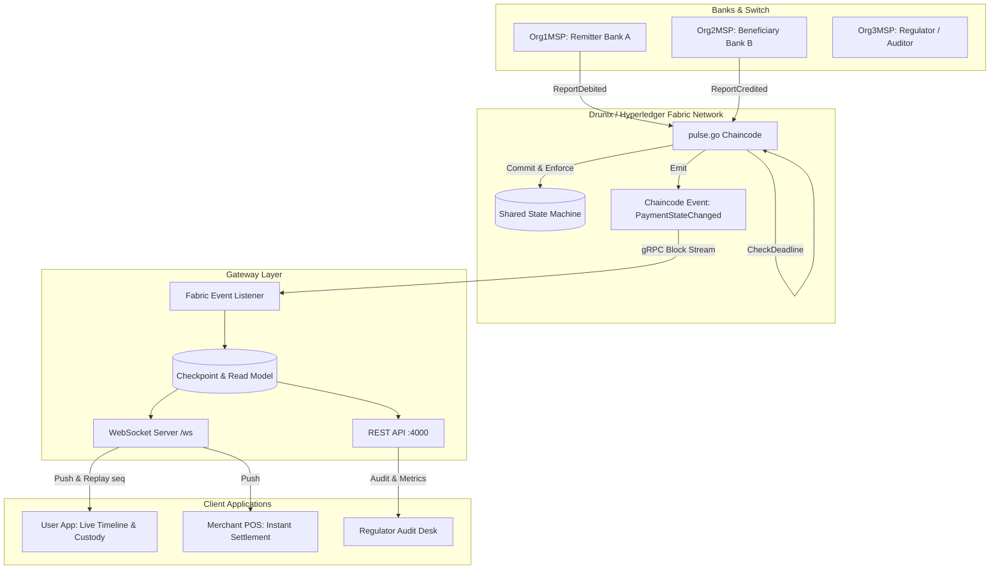

# Pulse — Verified, Push-Based Payment Status on a Shared Ledger

> **Track:** Real-Time Payments (DRUNIX Hackathon 2026, NPCI x Citi)  
> **Team:** Dharmik (Ledger) · Ritu (Backend) · Mithunn (Frontend & Delivery)  
> **License:** Apache 2.0  

---

## 1. Problem & Solution

### The Problem
When a real-time payment goes "pending", users are left in the dark. Apps aggressively poll status endpoints, wasting network bandwidth and server resources. When timeouts happen, neither the sender nor the recipient knows **who holds the money** or **which bank is responsible** for the delay, requiring manual, delayed batch reconciliation.

### The Solution: Pulse
Pulse replaces blind polling with **verified, push-based attestations on a shared permissioned ledger (Fabric 2.5 / Drunix)**:
- **Signed steps:** Each bank signs its own state transition (`DEBITED`, `CREDITED`, `REVERSED`, `DECLINED`). A bank cannot speak for another.
- **Accountability Clock:** Payments carry contractual SLA deadlines. If Beneficiary Bank sits on debited funds, chaincode automatically escalates the payment to `STUCK`, immediately visible to the regulator (`Org3MSP`).
- **Push, Not Poll:** Event streams push updates directly to user and merchant apps via WebSocket.
- **Fault-Tolerant Replay:** If mobile cellular connection drops, clients reconnect with their last block sequence (`lastSeq`) and receive all intermediate steps in a single atomic frame.

---

## 2. System Architecture



---

## 3. Quick Start (One Command)

### Prerequisites
- Node.js 20+
- Docker & Docker Compose
- (Optional for full ledger) Hyperledger Fabric 2.5 binaries & Go 1.21+

### Option A: Run Demo with Mock Gateway & Web UI (Fastest)

```bash
# 1. Install dependencies
make install

# 2. In Terminal 1: Start Mock Gateway (Port 4000)
make gateway-mock

# 3. In Terminal 2: Start Web Application (Port 5173)
make web-dev
```
Open **[http://localhost:5173](http://localhost:5173)** to interact with the live dashboard.

### Option B: Full Network Run via Docker Compose

```bash
make demo
```

---

## 4. Demo Scenarios

| Scenario | What Happens | What You See in Pulse |
|---|---|---|
| **1. Happy Path** | Payment initiated, debited by Bank A, credited by Bank B in 5s. | Steps appear in real-time. Custody switches from Remitter to Beneficiary, then settles green with signatures. |
| **2. Bank B Goes Silent** | Bank A debits funds, but Bank B fails to credit within 30s. | Banner flags **"Money is with: Beneficiary Bank (Org2MSP)"** with a live 30s SLA countdown. When expired, chaincode escalates state to `STUCK` on the regulator audit board. |
| **3. Disconnect & Replay** | Cellular network drops while transaction is mid-flight. | Click **"Simulate Drop & Catch-Up"**. Client drops WebSocket and reconnects with `lastSeq`. Gateway immediately replays all missed intermediate blocks in sequence. |
| **4. Late Credit Dispute** | Beneficiary attempts credit after remitter issued reversal. | State machine transitions to `DISPUTED`, requiring arbitration. |

---

## 5. Benchmarks & Results Summary

| Metric | Traditional Polling | Pulse (Push + Ledger) | Difference |
|---|---|---|---|
| **Status Requests per Payment** | 8 – 20 HTTP requests | **1 Connection (0 Polling)** | **~90-95% reduction** |
| **State Discovery Latency** | 500 – 1000ms delay | **< 20ms push on commit** | **96% faster notification** |
| **1,000 Pending Transactions** | 1,000 req/sec sustained | **0 req/sec polling load** | **Zero idle network overhead** |
| **Recovery after Disconnection** | Full status reload query | **Atomic `lastSeq` block replay** | **Zero missed transitions** |
| **Bandwidth Consumption** | ~2.8 KB per payment | **~0.5 KB per payment** | **82% payload savings** |

*Full analysis available in [docs/results.md](file:///Users/sivakumarkarthikeyan/Desktop/citi/docs/results.md).*

---

## 6. Shared Contracts & Repositories

| Folder | Owner | Role |
|---|---|---|
| [chaincode/](file:///Users/sivakumarkarthikeyan/Desktop/citi/chaincode) | Dharmik | Go contract state machine, MSP identity validation, endorsement policy |
| [network/](file:///Users/sivakumarkarthikeyan/Desktop/citi/network) | Dharmik | Fabric 2.5 CCaaS launch scripts (`up.sh`, `down.sh`, `collect-identities.sh`) |
| [gateway/](file:///Users/sivakumarkarthikeyan/Desktop/citi/gateway) | Ritu | TypeScript gateway, Fabric event listener, WebSocket replay, SQLite read model |
| [web/](file:///Users/sivakumarkarthikeyan/Desktop/citi/web) | Mithunn | React 18, Vite, Tailwind v4, Timeline, Merchant POS, Regulator Desk |
| [bench/](file:///Users/sivakumarkarthikeyan/Desktop/citi/bench) | Mithunn | Polling vs. push benchmark test scripts & results |
| [docs/](file:///Users/sivakumarkarthikeyan/Desktop/citi/docs) | Team | Contracts ([docs/contracts.md](file:///Users/sivakumarkarthikeyan/Desktop/citi/docs/contracts.md)), Ledger ([docs/ledger.md](file:///Users/sivakumarkarthikeyan/Desktop/citi/docs/ledger.md)), Results ([docs/results.md](file:///Users/sivakumarkarthikeyan/Desktop/citi/docs/results.md)) |

---

## 7. Known Limitations & Honest Caveats

- **Simulation:** All banks (Bank A, Bank B) and payment payloads are 100% synthetic. No real UPI or banking credentials were used.
- **Ledger Environment:** Tested locally on Hyperledger Fabric 2.5 with Raft consensus. Drunix-specific deployment parity depends on container runtime availability.
- **Replay Mode:** For demo environments where Docker/Fabric cannot run (e.g. static GitHub Pages), `web` includes a pre-recorded replay mode loaded from `public/replay/events.json`.

---

## 8. Team

- **Dharmik** — Ledger Lead (`chaincode/`, `network/`)
- **Ritu** — Backend Lead (`gateway/`, `simulators/`)
- **Mithunn** — Frontend, Benchmarks & Delivery Lead (`web/`, `bench/`, root configs, CI)
